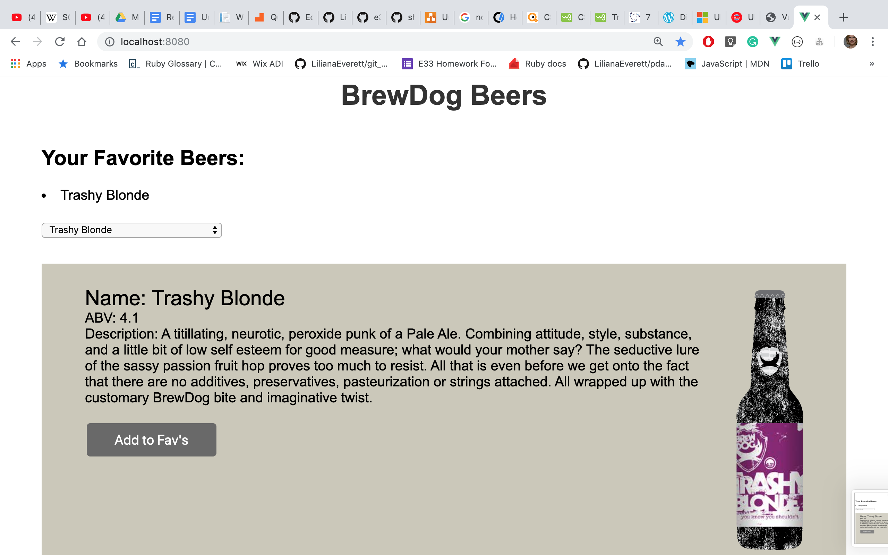

# Lab: Make an app with the Brewdog API

## Learning Objectives

- Be able to make API requests in a Vue app
- Be able to design a Vue component hierarchy from scratch 
- Be able to implement Vue components

Your task is to build an app that uses [this API](https://punkapi.com/documentation/v2) to display information on a variety of beers.

[This endpoint](https://api.punkapi.com/v2/beers) will provide you with some data detailing multiple beers.

## MVP

Your app should be able to:

- Allow the user to view all the beers
- Allow the user to view more detailed information on a selected beer
- Allow the user to mark beers as 'favourites'
- Display the user's favourite beers

## Extensions

- Prevent the user from marking the same beer as a favourite more than once
- Allow the user to deselect favourite beers
- Display the selected beer's ingredients (without duplicates)

## Advanced Extension

- By default the API gives us 25 beers. Read the [documentation](https://punkapi.com/documentation/v2) to research pagination. Allow the user to see further pages of beers. 

## To view the application running:

download or clone the repository.

In the terminal: cd into the repository folder 

`npm install`

`npm build`

`cd public`

`npm run serve`

In the browser:

http://localhost:8080/ 
